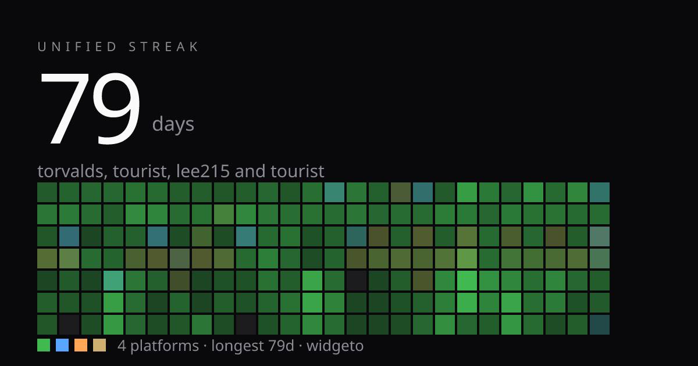
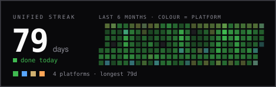
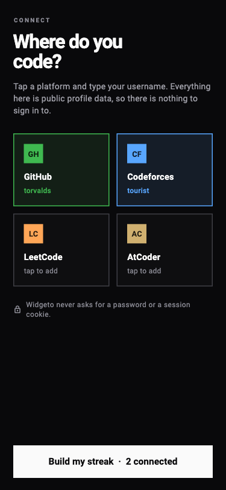
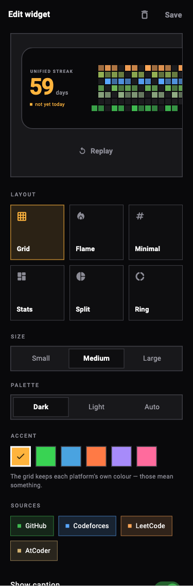
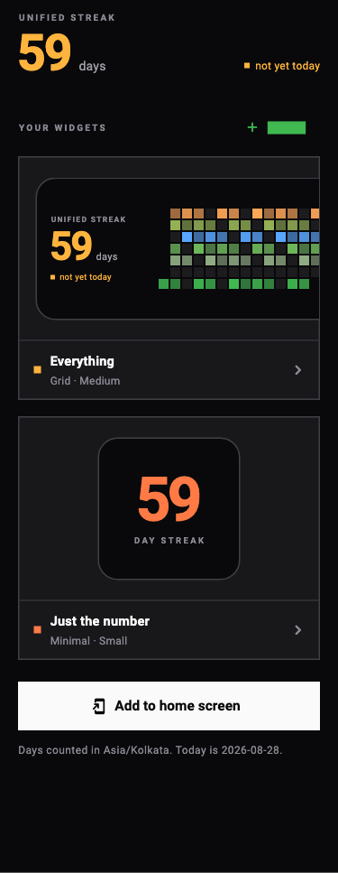
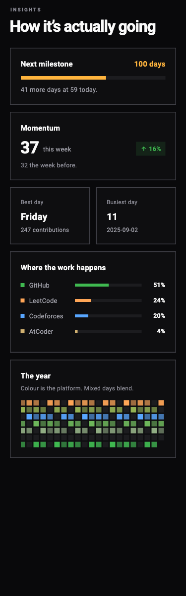
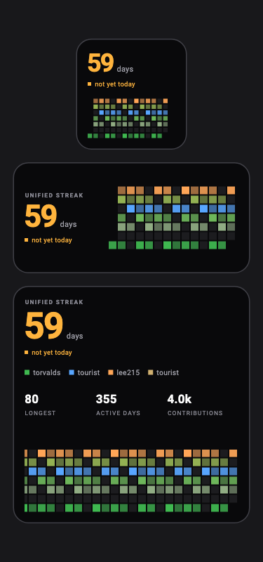
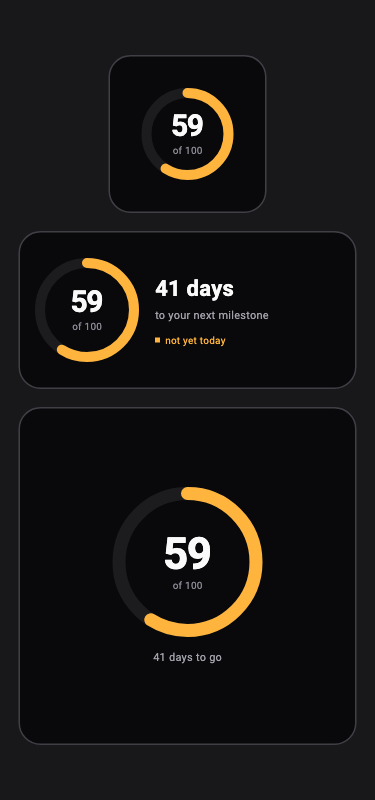
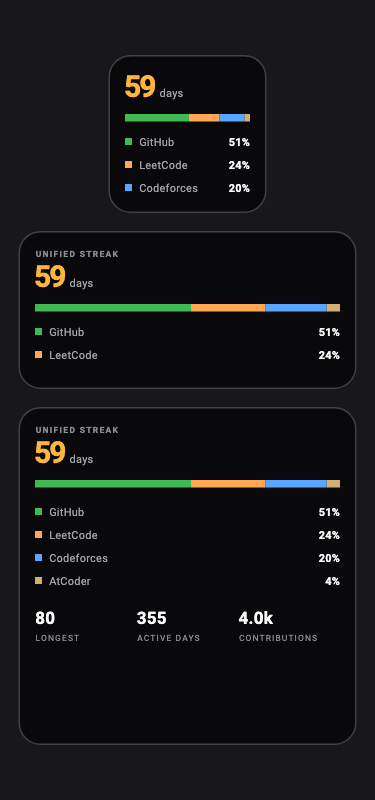

<div align="center">



# Widgeto

**One streak across every platform you code on.**

You don't have a GitHub streak and a LeetCode streak. You have *one habit*
scattered across four sites. Widgeto merges them into a single number and puts
it on your home screen.

[](https://github.com/kabirvashisht4-glitch/Widgeto/actions/workflows/ci.yml)
[](LICENSE)
[](#connected-platforms)

</div>

---

## What it does

Most streak tools watch one site. If you ship code on Monday, grind LeetCode on
Tuesday and enter a Codeforces round on Wednesday, every one of them tells you
your streak is broken. It isn't — you worked all three days.

Widgeto counts the habit, not the hostname.

<table>
<tr>
<td width="50%">

**One number, not four**
Do anything on any connected platform and the day counts.

**Colour is the platform**
Each grid square takes the colour of the platform the work happened on, and
days across several blend. A normal grid can only say *you did something*;
this one says *what*.

</td>
<td width="50%">

**No account, ever**
Every source is public profile data keyed by username. No OAuth wall, no
password. Thirty seconds from opening it to a working widget.

**An empty today is pending, not broken**
Your streak survives until midnight in *your* timezone. The day isn't over.

</td>
</tr>
</table>

---

## Try it in 10 seconds

No install, no signup:

```bash
npx --yes degit kabirvashisht4-glitch/Widgeto widgeto && cd widgeto
npm install
npm run streak -- --github torvalds --codeforces tourist --leetcode lee215
```

```
   62 day unified streak   ✓ safe
   longest 80d · 356 active days · 4,043 contributions

   ■■■□■■■■□■■■■■■□■■■■■■■■■■□■■■■■■■■■■■■■□■■■■■■■■■■
   ...

 ✓ GitHub       @torvalds   3602 contributions · 257026 stars
 ✓ Codeforces   @tourist    3528 rating · legendary grandmaster
 ✓ LeetCode     @lee215     671 solved · #107,571 rank
```

GitHub's GraphQL API rejects anonymous requests even for public contribution
calendars, so set `GITHUB_TOKEN` or be signed in to the [`gh` CLI][gh]. The
other three connectors need no credentials at all.

---

## Put your streak in your README

A live SVG that updates on its own:

<div align="center">
  
</div>

```markdown
[](https://YOUR-DEPLOY/u/gh-YOU+lc-YOU)
```

There's a compact style too — `&style=flat` — which renders as
.

---

## The app

<div align="center">
  
  
  
  
</div>

**Install it from the browser** — no App Store, no TestFlight, nothing to
sideload. Open `/app` on your deployment, then *Add to Home Screen* (iOS) or
*Install app* (Android). It runs full-screen and works offline.

### A widget is data, not a fixed design

That's forced, not chosen: a widget extension can't run user-written code — the
App Store forbids downloading executables and SwiftUI views must be compiled in.
So a "custom widget" has to be a config a fixed renderer interprets. Six layouts,
three sizes, two palettes, six accents, and per-widget source selection:

<div align="center">
  
  
  
</div>

| Layout | Shows |
|---|---|
| **Grid** | The blended contribution calendar |
| **Flame** | How much of today is left before the streak dies |
| **Minimal** | One number, nothing else |
| **Stats** | Streak, longest, active days, total |
| **Split** | Where the streak came from — the view no single-platform widget can offer |
| **Ring** | Progress toward your next milestone |

---

## Run it yourself

```bash
git clone https://github.com/kabirvashisht4-glitch/Widgeto.git
cd Widgeto
npm install

echo "GITHUB_TOKEN=$(gh auth token)" > apps/web/.env.local   # or paste a PAT

npm run dev          # http://localhost:3210
```

To include the installable app (needs [Flutter][flutter]):

```bash
./scripts/build-app.sh      # builds into apps/web/public/app, served at /app
```

The script exits cleanly if Flutter isn't installed — the site and API build
fine without it.

### Deploying

[](https://vercel.com/new/clone?repository-url=https%3A%2F%2Fgithub.com%2Fkabirvashisht4-glitch%2FWidgeto&env=GITHUB_TOKEN&envDescription=A%20classic%20GitHub%20token%20with%20NO%20scopes%20-%20public%20contribution%20calendars%20only&envLink=https%3A%2F%2Fgithub.com%2Fsettings%2Ftokens%2Fnew&project-name=widgeto&repository-name=widgeto)

Any Node host works. On Vercel, import the repo and set one environment
variable:

| Variable | Required | What it's for |
|---|---|---|
| `GITHUB_TOKEN` | yes | A classic PAT with **no scopes**. Public contribution calendars only. |
| `NEXT_PUBLIC_SITE_URL` | no | Canonical URL for social cards. Inferred from `VERCEL_URL` otherwise. |

`GET /api/health` tells you whether the token actually landed — a deploy that
forgot it returns `503` with `{"checks":{"githubToken":false}}` instead of
failing silently for every user.

---

## Connected platforms

| Platform | Access | Day precision | Notes |
|---|---|---|---|
| **GitHub** | Official GraphQL | UTC day | Needs a token even for public data |
| **Codeforces** | Official public API | **Exact** | Anonymous, ~1 req/2s, per-submission timestamps |
| **AtCoder** | Community mirror ([kenkoooo]) | **Exact** | No first-party API exists |
| **LeetCode** | Public profile endpoint | UTC day | Unofficial — can break without notice |

Marked honestly on purpose. A dead connector greys out one row; it never takes
the widget down with it. Public profiles only — **Widgeto never asks for a
password or a session cookie.**

Adding a platform is one file and one registry line:

```ts
// packages/core/src/connectors/yours.ts
export async function fetchYours(handle: string, ctx: FetchContext): Promise<PlatformResult> {
  // …return day counts; failure is a value, not an exception
}
```

Nothing downstream — streak engine, API, widget — changes. See
[CONTRIBUTING.md](CONTRIBUTING.md).

---

## How it fits together

```
 GitHub ─┐
 Codef.  ├─► connectors ─► local-day normalisation ─► one merged timeline
 AtCoder │                                                    │
 LeetC. ─┘                                          ┌─────────┴─────────┐
                                              /api/streak         streak engine
                                                    │
                         ┌──────────────────────────┼──────────────────────┐
                      website                  /api/badge            Flutter app
                   /u/… /compare            README + social            │
                                                                 iOS + Android
                                                                  widget faces
```

Every connector reduces to the same shape — a sparse list of day counts in the
user's timezone — so the streak engine, the API and the widget renderer never
learn anything platform-specific.

### Three decisions worth knowing

**Timezone first.** Every day boundary resolves through your IANA zone.
Codeforces and AtCoder expose per-submission timestamps so their days are
exact; GitHub and LeetCode only publish a UTC grid, and those are labelled
`utc-day` in the UI rather than quietly papered over. An off-by-one hour in a
streak app isn't a rounding error, it's a broken promise.

**An empty today is `at-risk`, never `broken`.** A naive implementation zeroes
your streak at 00:00 and demoralises you for the next sixteen hours.

**Connector failure is a value, not an exception.** The widget is expected to
render *something* every single time it's asked.

---

## API

All endpoints are public, read-only and rate-limited (30/min, 60/min for
badges). CORS is open — build on it.

| Endpoint | Returns |
|---|---|
| `GET /api/streak?github=…&codeforces=…&tz=…` | Merged streak, heatmap and per-platform detail as JSON |
| `GET /api/badge?…&style=card\|flat` | Live SVG for a README |
| `GET /api/health` | Configuration and liveness |

```bash
curl "https://YOUR-DEPLOY/api/streak?github=torvalds&tz=Asia/Kolkata" | jq .summary
```

Handles are forgiving: a bare username, an `@handle`, or a pasted profile URL
all work.

---

## Project layout

| Package | What it is |
|---|---|
| `packages/core` | Connectors + streak engine. Zero dependencies; runs in Node, Next and Workers. |
| `apps/web` | Website, public API and badge renderer (Next.js) |
| `apps/mobile` | Flutter app, PWA, and the native iOS/Android widget faces |

```bash
npm test                        # engine + API unit tests
cd apps/mobile && flutter test  # app tests and goldens
```

Goldens render the real screens to PNG, so a layout regression shows up as an
image diff rather than as something nobody noticed until it shipped. They are
host-specific — font rasterisation differs across platforms — so they are
tagged and CI runs them on macOS only. See [CONTRIBUTING.md](CONTRIBUTING.md).

---

## Status

Working and verified: the engine, the website, the public API, and the Flutter
app (analyzer clean, tests and goldens passing, builds and runs as a PWA).

Not yet shipped: signed native iOS/Android builds. The WidgetKit and Glance
faces are written, but producing an `.ipa` or `.apk` needs Xcode and the
Android SDK — see [apps/mobile/README.md](apps/mobile/README.md) for the App
Group setup, which is the usual reason a widget renders zeros forever.

---

## Credits

Architecture informed by [Forge][forge] by Rakshit Yadav (MIT), which solves the
same Flutter + native-widget bridge for GitHub alone. Widgeto adds the
multi-platform connector layer and the merged streak.

Widgeto is independent and not affiliated with GitHub, Codeforces, LeetCode or
AtCoder.

**[MIT licensed](LICENSE)** — if it's useful, a ⭐ helps other people find it.

[gh]: https://cli.github.com
[flutter]: https://docs.flutter.dev/get-started/install
[kenkoooo]: https://kenkoooo.com/atcoder
[forge]: https://github.com/rakshityadav1868/github-widget
